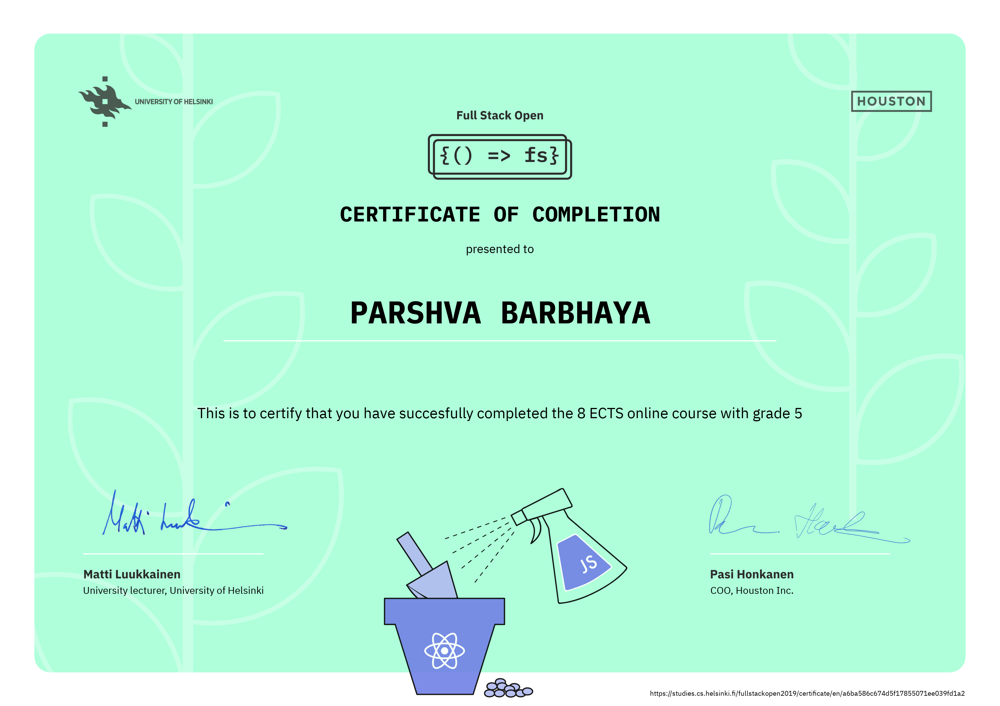

<h1 align="center">Full Stack - Open</h1>
<h3 align="center">Full stack open course by University of Helsinki</h3>

## Current Progress

* [Part 0] (https://github.com/parshva-b/fullstack-open/tree/master/part0)
* [Part 1] (https://github.com/parshva-b/fullstack-open/tree/master/part1)
* [Part 2] (https://github.com/parshva-b/fullstack-open/tree/master/part2)
* [Part 3] (https://github.com/parshva-b/fullstack-open/tree/master/part3/phonebook)
* [Part 4] (https://github.com/parshva-b/fullstack-open/tree/master/part4/blogs-backend)
* [Part 5] (https://github.com/parshva-b/fullstack-open/tree/master/part5)
* [Part 6] (https://github.com/parshva-b/fullstack-open/tree/master/part6)
* [Part 7] (https://github.com/parshva-b/fullstack-open/tree/master/part7)
* [Part 8] (https://github.com/parshva-b/fullstack-open/tree/master/part8/library)

- [@course-link](https://fullstackopen.com/en/)
- [@course-submission](https://studies.cs.helsinki.fi/fullstackopen2019/#/)

    
    
 Completed certification 

Technologies used:

| Frontend | Backend | Testing |
| --- | --- | --- |
| React | MongoDB | Jest |
|  | NodeJS (Express) | Cypress.IO |
|  | GraphQL |  |
